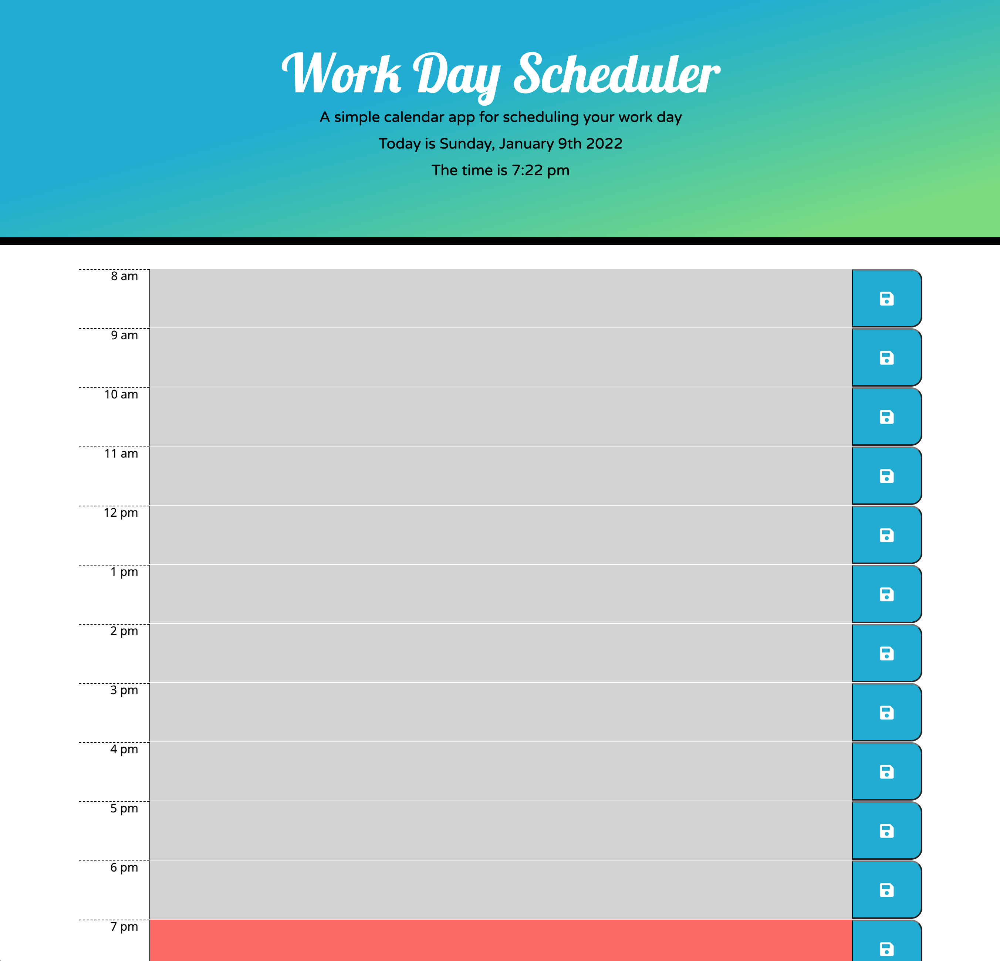

# Work Day Scheduler: Schedulerr

## Purpose 

The purpose of this project is to create an application that allows busy employees to add important events to their daily planner so they can manage their time effectively 

## Application Details 

### Features: 
* Current Date and Time always displayed at top of page, automatically updates 
* Time blocks are color-coded to indicate past, present, or future
* Save button utilizes local storage to keep track of your tasks

### Screenshot: 

## Deployed Application

This application is deployed through GitHub Pages. 
This application can be accessed by clicking this link: 
https://kalecodes.github.io/schedulerr/

